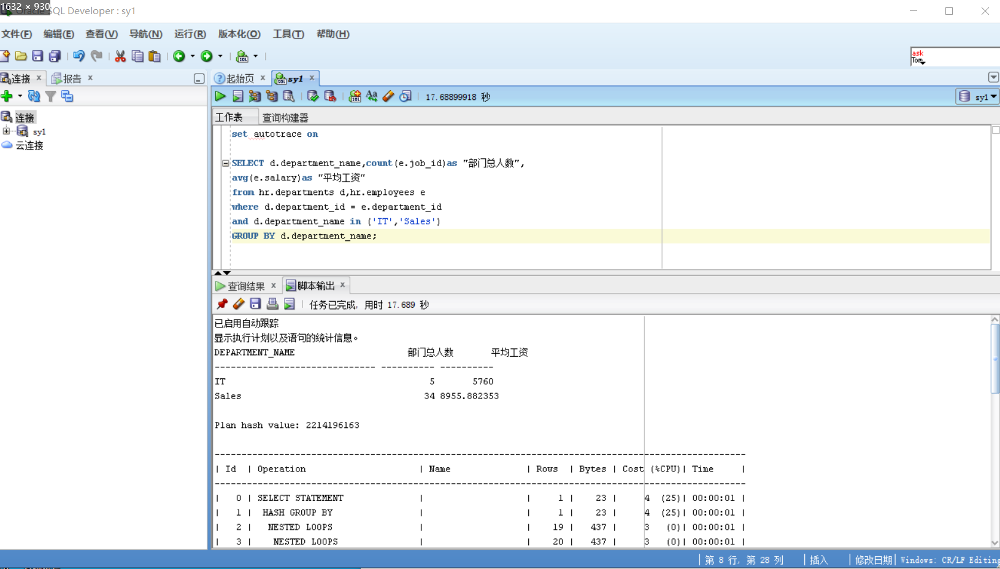
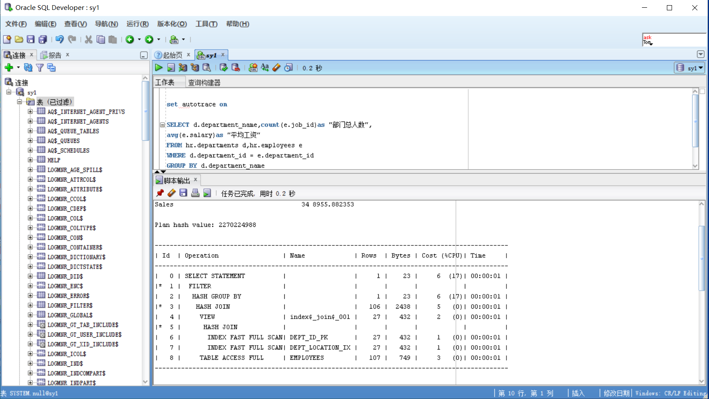
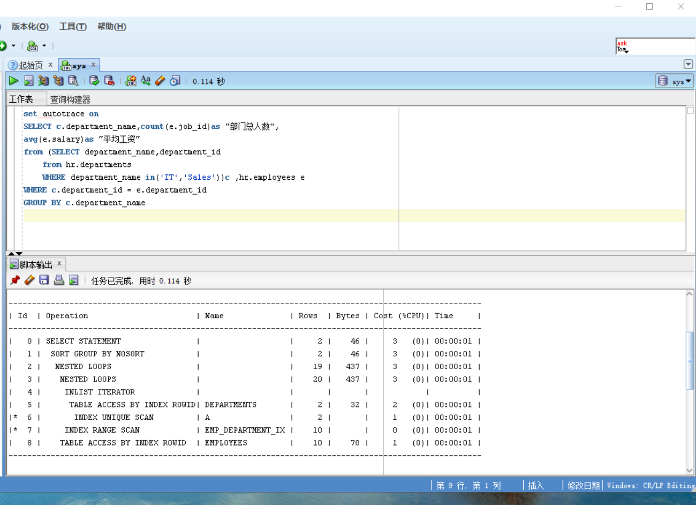

set autotrace on

SELECT d.department_name,count(e.job_id)as "部门总人数",
avg(e.salary)as "平均工资"
from hr.departments d,hr.employees e
where d.department_id = e.department_id
and d.department_name in ('IT','Sales')
GROUP BY d.department_name;

set autotrace on

SELECT d.department_name,count(e.job_id)as "部门总人数",
avg(e.salary)as "平均工资"
FROM hr.departments d,hr.employees e
WHERE d.department_id = e.department_id
GROUP BY d.department_name
HAVING d.department_name in ('IT','Sales');

set autotrace on
SELECT c.department_name,count(e.job_id)as "部门总人数",
avg(e.salary)as "平均工资"
from (SELECT department_name,department_id
    from hr.departments
    WHERE department_name in('IT','Sales'))c ,hr.employees e
WHERE c.department_id = e.department_id 
GROUP BY c.department_name

